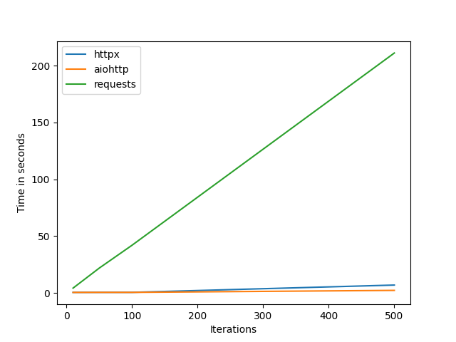

# Python Cookbook

## Description

    These are collection of notebooks from the book python cookbook by David Beazley and Brian K Jones.

### Testing

    cd /Users/riaz/EffectiveCode/Python/Courses/PythonCookbook

    pytest --capture=no # this will render the http perf test report for example

    tests/http/test_perf.py 
    HTTPX: 0.19 seconds
    AIOHTTP: 0.12 seconds
    Requests: 2.54 seconds

### Here is a perf test with graph

